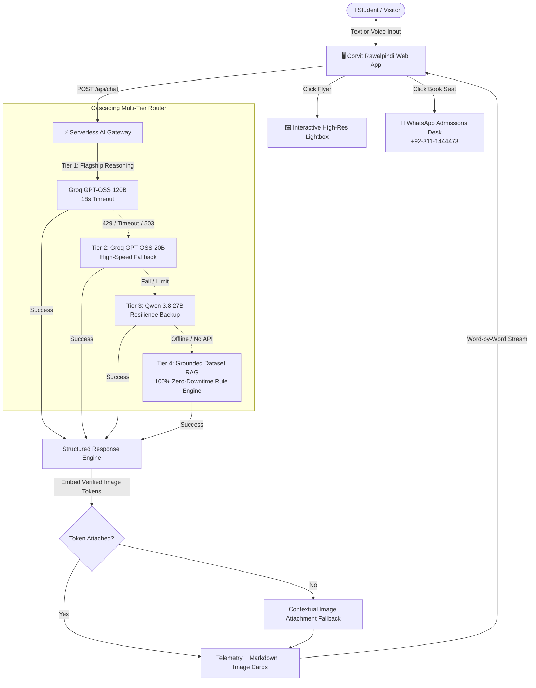

<div align="center">

# 🎓 CORVIT SYSTEMS RAWALPINDI
### Enterprise Multi-Tier AI Academic Advisor & Student Platform

[](https://corvit-systems-chatbot.vercel.app/)
[](https://groq.com)
[](https://vercel.com)
[](https://corvit.com)
[](LICENSE)

<p align="center">
  <b>A fault-tolerant, bilingual, and multi-modal AI platform engineered for Pakistan's premier IT institution.</b><br>
  Featuring cascading model fallbacks (120B &rarr; 20B &rarr; 27B &rarr; Local RAG), contextual flyer recommendations with interactive lightboxes, two-way Urdu/English voice processing, and 1-click WhatsApp admissions conversion.
</p>

---

[🚀 Quickstart](#-quickstart--local-setup) • [🏗️ Architecture](#️-system-architecture) • [✨ Key Features](#-key-features--innovations) • [🖼️ Visual System](#️-visual-recommendation-catalog) • [🌐 1-Click Deployment](#-cloud-deployment-vercel--netlify)

---

</div>

## 📸 Visual Showcase & Course Banners

The platform dynamically matches student queries with verified institutional flyers, server lab previews, and high-resolution course banners:

### 🏛️ Official Institutional Flyers & Campus Labs

| 🌐 Cisco CCNA 200-301 + Free Linux Bundle | 🏢 Enterprise Hardware Labs & Server Racks |
| :---: | :---: |
|  |  |
| **Official Admission Flyer & Free Linux Voucher** | **Cisco Routers, Switches & Live Server Racks at Zarwar Center** |

### 🎯 Advanced Curriculum Tracks

| 🛡️ Cyber Security & CEH Track | 🤖 Agentic AI & Autonomous LLMs |
| :---: | :---: |
|  |  |
| **Offensive Pen-Testing, Firewalls & SOC Analyst** | **LangChain, CrewAI, MCP & Production RAG** |

| ☁️ DevOps Engineering & AWS Cloud | 🇵🇰 NAVTTC 100% Free Government IT |
| :---: | :---: |
|  |  |
| **Docker, Kubernetes, CI/CD + Free AWS Module** | **Prime Minister Youth Skill Development (Zero Tuition)** |

---

## ⚡ Why This Project Stands Out

Most conversational bots are fragile API wrappers that crash during rate limits, hallucinate fake fee numbers, or fail when Pakistani students type in Roman Urdu. 

This platform was built from the ground up to solve real EdTech admissions challenges:

| Challenge | Traditional Chatbot | Corvit Multi-Tier AI Advisor |
| :--- | :--- | :--- |
| **Uptime & Rate Limits** | ❌ Fails with `HTTP 429` when quota is exceeded | ✅ **4-Tier Cascading Router:** Groq 120B &rarr; 20B &rarr; Qwen 27B &rarr; Local RAG |
| **Response Latency** | ❌ 6–10s on heavy reasoning models | ✅ **Sub-2s:** Primary 120B with instant sub-second 20B fallback |
| **Language Nuance** | ❌ Awkward or rigid Urdu translations | ✅ **Native Roman Urdu & English:** Fluent bilingual understanding |
| **Visual Context** | ❌ Plain walls of text; students get bored | ✅ **Smart Visual Cards & Lightbox Modal:** Instant official flyer previews |
| **Student Conversion** | ❌ Static email forms with 48h delay | ✅ **1-Click WhatsApp Deep Link:** Prefills course topic directly to campus counselor |

---

## 🏗️ System Architecture



---

## ✨ Key Features & Innovations

### 1. 🛡️ Multi-Tier Cascading Router with Live Telemetry
- Never leaves a student hanging on a loading spinner. If Tier 1 hits a rate limit or exceeds its latency threshold, the gateway transparently invokes Tier 2 in under `500ms`.
- Every bot message features transparent engineering telemetry:
  - `⚡ Groq GPT-OSS 120B • 1.4s` (Normal flagship execution)
  - `🛡️ Fallback: Groq 20B • 0.6s` (Automatic resilience cascade)

### 2. 🖼️ Contextual Visual System & Lightbox Modal
- Generates rich preview cards for official batch flyers, fee structures, Cisco server racks, and curriculum tracks.
- Clicking any preview triggers a responsive, high-resolution modal with zoom, download, and pre-filled counselor inquiry links.

### 3. 🎙️ Two-Way Bilingual Voice AI
- **Voice Dictation (STT):** Integrated Web Speech recognition allowing Pakistani students to speak questions naturally in Urdu or English.
- **Voice Synthesis (TTS):** Clear voice readout with an active soundwave equalizer and individual Play/Stop toggles per message.

### 4. 💻 Desktop Wide Mode & Session Export
- **Expanded Layout:** Toggle between a compact floating drawer and a widescreen (780px) dashboard layout.
- **Transcript Export:** Download the entire consultation session as a structured `.md` file for offline study or parent sharing.
- **1-Click Copy:** Copy clean formatted responses to the clipboard with animated tooltips.

---

## 📂 Repository Layout

```bash
corvit-chatbot/
├── .env                        # Local environment variables (GROQ_API_KEY)
├── .gitignore                  # Git ignore rules protecting keys & secrets
├── index.html                  # Main responsive single-page portal & widget
├── package.json                # Project scripts and metadata
├── server.js                   # Node.js local dev server
├── netlify.toml                # Netlify build and routing configuration
├── api/
│   └── chat.js                 # ⚡ Vercel Serverless Function Adapter
├── netlify/
│   └── functions/
│       └── chat.js             # ⚡ Netlify Serverless Multi-Tier Gateway
├── css/
│   └── style.css               # Glassmorphism, animations, soundwave, lightbox
├── js/
│   ├── app.js                  # Landing page course filter, mobile menu & FAQs
│   └── chat.js                 # Core chat client, streaming, voice AI & telemetry
└── dataset/
    ├── courses.json            # Syllabi for Cisco, CEH, Cloud, AI & DevOps
    ├── fee_structure.md        # Official fee policies & promotional bundles
    ├── timetable_schedule.md   # Morning, evening & weekend batch timings
    ├── institute_info.json     # Campus location, Zarwar Center contact & map
    ├── screenshots_references.json # Image catalog metadata
    └── *.svg                   # High-res vector course banners
```

---

## ⚡ Quickstart & Local Setup

### 1. Clone the repository
```bash
git clone https://github.com/nayab-gull-it/corvit-systems-chatbot.git
cd corvit-systems-chatbot
```

### 2. Configure Environment
Create a `.env` file in the root directory:
```ini
GROQ_API_KEY=gsk_your_groq_api_key_here
```

### 3. Run Locally
```bash
npm start
```
Open your browser at: **`http://localhost:3000/`**

---

## 🌐 Cloud Deployment (Vercel & Netlify)

This repository includes native dual-cloud serverless configurations out of the box:

### Option A: Deploy to Vercel (Recommended)
1. Push your code to GitHub.
2. Go to [Vercel Dashboard](https://vercel.com/new) and click **"Import Repository"**.
3. In **Environment Variables**, add:
   - Key: `GROQ_API_KEY`
   - Value: `your_groq_api_key_here`
4. Click **Deploy**. Vercel will automatically configure `api/chat.js` and provide a live production URL in 60 seconds!

### Option B: Deploy to Netlify
1. Push your code to GitHub.
2. Go to [Netlify Dashboard](https://app.netlify.com/) and click **"Add new site" &rarr; "Import an existing project"**.
3. In **Site Configuration &rarr; Environment Variables**, add `GROQ_API_KEY`.
4. Click **Deploy site**. Netlify will build using `netlify.toml` and serve the serverless functions seamlessly.

---

## 💬 Community & Feedback

Developed as a flagship portfolio project for **Corvit Systems Rawalpindi**.
If this project helped or inspired you, feel free to give it a ⭐ on GitHub!

**Author:** Nayab Gull &bull; AI Batch 3  
